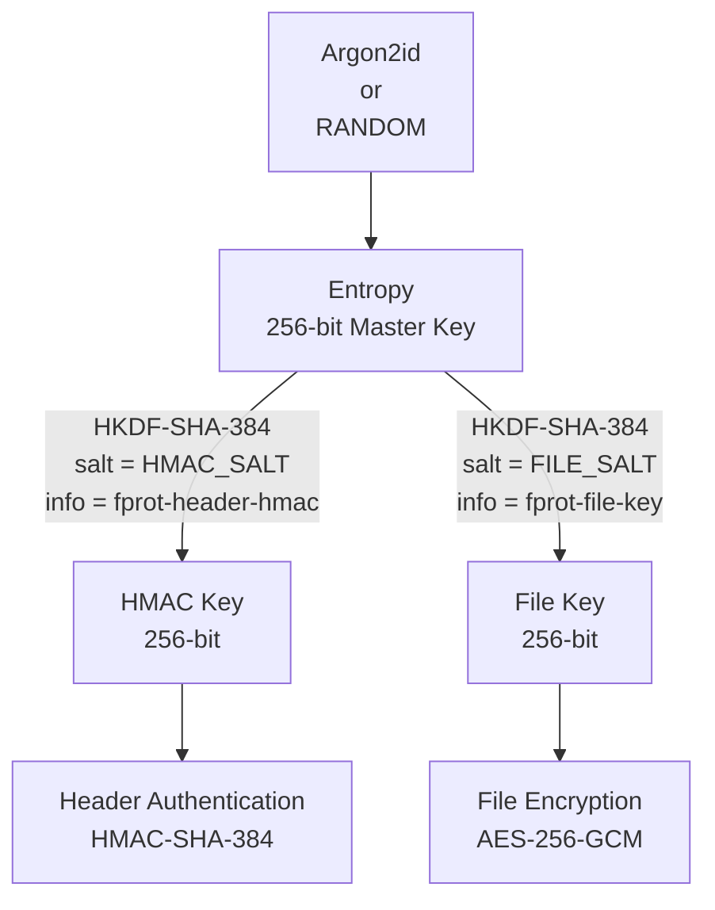

# The FProt File Format

This document describes the format used by files encrypted with the **FProt** software.

The format is inspired by the one used by the
[age](https://github.com/FiloSottile/age) software, adapted for FProt.

---

## General Conventions

* All textual parts of the file are encoded in **UTF-8**
* Each line ends with **LF (`\n`)**
* All binary fields in the header are encoded in **standard Base64**

---

## Key Management

To encrypt a file, FProt generates a **256-bit** secret key called `entropy`.

`entropy` **MUST** be freshly generated for each individual encryption operation
and **MUST NOT** be reused.

`entropy` can be generated in two ways, depending on the encryption mode:

* **Derived from a password** (ARGON2)
* **Randomly generated** (ECIES / public keys)

`entropy` acts as a *master key* for deriving subkeys:

* **File Key** — used to encrypt the file contents
* **HMAC Key** — used to authenticate the header

> [!WARNING]
> The security of the format requires that `entropy` is always different for each file.
> In the password-derivation case, this is guaranteed by Argon2’s random salt.
> In the ECIES case, `entropy` is generated as a random 256-bit value.

### Graph

---

### Password Derivation (ARGON2)

Argon2id parameters:

```
ARGON2ID_ITERATIONS = 10
ARGON2ID_MEMORY     = 128 * 1024   // KiB
ARGON2ID_THREADS    = 4
ARGON2ID_KEY_LENGTH = 32
```

Derivation:

```
salt    = GetRandomBytes(16)
entropy = ARGON2ID(password, salt)
```

The `salt` is included in the header as part of the ARGON2 recipient.

---

### Subkey Derivation

Subkeys are derived from `entropy` using HKDF-SHA-384.

```
hmacKey = HKDF-SHA384(
    seed = entropy,
    salt = "HMAC_SALT",
    info = "fprot-header-hmac",
    size = 32
)

fileKey = HKDF-SHA384(
    seed = entropy,
    salt = "FILE_SALT",
    info = "fprot-file-key",
    size = 32
)
```

The `salt` and `info` strings are ASCII and constant.

---

## The Header

Each file encrypted with FProt starts with a textual header composed of:

1. **Version line**
2. **Recipient blocks**
3. **HMAC line**

The binary body of the file begins **immediately after** the newline that terminates the HMAC line.

---

### Version Line

A single line with a fixed value:

```
fprot/v1
```

---

### Recipient Blocks

Each recipient is represented by **two lines**:

1. Header line:

   ```
   -> TYPE [arg1 arg2 ...]
   ```

2. Recipient body:

   ```
   base64(body)
   ```

Where:

* `TYPE` is the recipient type (`ARGON2` or `P384`)
* `argN` are optional arguments depending on the type
* `body` is a binary blob encoded in Base64

#### Example

```
-> ARGON2
8c32bvRpKU4IzArRgu6W4w==
```

---

#### ARGON2 Recipient

When using a password, the header contains **exactly one** ARGON2 recipient.

Format:

```
-> ARGON2
[base64(salt)]
```

Constraints:

* Combining `ARGON2` with `P384` is not allowed
* More than one `ARGON2` recipient is not allowed

---

#### P384 Recipient (ECIES)

When encrypting for one or more public keys, each P384 recipient has the following format:

```
-> P384 [base64(ephemeral public key)]
[base64(ecies wrapped entropy)]
```

##### Wrapping `entropy`

```
entropy                = GetRandomBytes(32)
recipient              = recipient public key
ephemeralPrivateKey    = ephemeral NIST P-384 private key
ephemeralPublicKey     = ephemeral public key

salt = SHA256(ephemeralPublicKey || recipient)

sharedSecret = ephemeralPrivateKey.ECDH(recipient)

keyWrapKey = HKDF-SHA384(
    seed = sharedSecret,
    salt = salt,
    info = "fprot-ecies-shared-secret",
    size = 32
)

aesNonce = GetRandomBytes(12)   // 96 bit

eciesWrappedEntropy = aesNonce || AES-256-GCM(
    key   = keyWrapKey,
    nonce = aesNonce,
    data  = entropy
)
```

---

### Header HMAC

The header is authenticated using **HMAC-SHA-384**.

The HMAC line is the final line of the header and has the format:

```
--- base64(hmac)
```

#### HMAC Calculation

```
hmacData = canonicalHeader
hmac     = HMAC-SHA384(hmacKey, hmacData)
```

Where `canonicalHeader` is the byte-for-byte concatenation of:

```
version "\n"
recipient_1
recipient_2
...
recipient_n
```

Each recipient includes **both of its lines**, including the trailing newline.

---

## Encrypted File Body

The body contains a sequence of chunks encrypted with **AES-256-GCM**.

Each chunk is independent and authenticated.

---

### AES-GCM Nonce Construction

For each chunk:

```
counter = uint64, BigEndian, initialized to 0
random  = GetRandomBytes(4)

nonce = random || counter   // 96 bit
```

The counter **MUST**:

* start at zero
* be incremented by 1 for each chunk
* never be reused with the same `fileKey`

Under these invariants, each `(fileKey, nonce)` pair is guaranteed to be unique.

---

### AAD (Additional Authenticated Data)

```
AAD = nonce || ciphertextSize
```

Where `ciphertextSize` is a `uint32` BigEndian.

---

### Chunk Format

```
|--------------------------------|
|        RANDOM (4 bytes)        |
|--------------------------------|
|     CHUNK COUNTER (8 bytes)    |
|--------------------------------|
|    CIPHERTEXT SIZE (4 bytes)   |
|--------------------------------|
|                                |
|    ENCRYPTED CHUNK (128 KiB)   |
|                                |
|--------------------------------|
| AUTHENTICATION TAG (16 bytes)  |
|--------------------------------|
```

The final chunk may be smaller than 128 KiB.
Zero-length chunks are not allowed.

---

## Security Considerations

* Each file uses a unique `fileKey`:

  * `entropy` is derived via Argon2 with a 128-bit salt or is fully random; therefore, it is never possible for two different files to have the same `entropy`
* The counter guarantees nonce uniqueness per key (critical for security)
* Nonce collisions across different files are irrelevant (`entropy` is always different)

---

# Hexdump example
To inspect an encrypted message, you can use `xxd`:
```bash
echo -n "test" | fprot encrypt -p password | xxd
```

```text
00000000: 6670 726f 742f 7631 0a2d 3e20 4152 474f  fprot/v1.-> ARGO
00000010: 4e32 0a59 7376 3252 2f51 4355 4536 3069  N2.Ysv2R/QCUE60i
00000020: 3758 466f 524c 6d78 513d 3d0a 2d2d 2d20  7XFoRLmxQ==.---
00000030: 784a 6564 3543 7a2b 6e73 7378 3776 746c  xJed5Cz+nssx7vtl
00000040: 4b59 6954 6d58 5746 3876 654f 4159 544d  KYiTmXWF8veOAYTM
00000050: 4355 6d4a 544f 3563 4248 7637 6831 6c47  CUmJTO5cBHv7h1lG
00000060: 4e74 464f 3236 5765 5978 6745 5069 6e44  NtFO26WeYxgEPinD
00000070: 0af3 dde2 3c00 0000 0000 0000 0000 0000  ....<...........
00000080: 1416 ce1e 2e36 cf98 4b8c 82ad cbcc c5cf  .....6..K.......
00000090: a965 e049 0f                             .e.I.
```